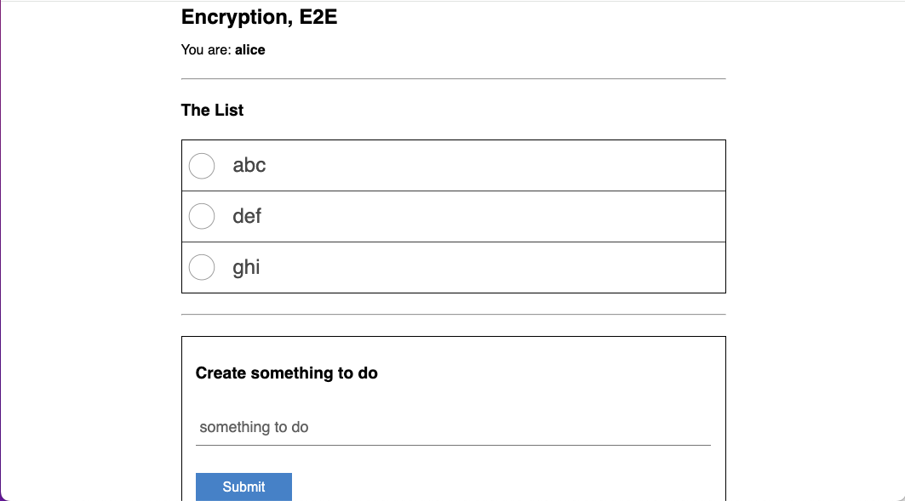

# level todo

__The premise__

Let's make a todo list. People seem to like those. They are fairly common.

<[make a todo list](https://github.com/nichoth/level-todo/blob/3f1b687e4b65d970c31b3f4642a4172156b01fce/example/state.ts)>

That was easy. We have made a todo list app, and it persists data locally, because we are the only person who cares about what's on it. Because we are using [indexedDB](https://developer.mozilla.org/en-US/docs/Web/API/IndexedDB_API/Using_IndexedDB), we can refresh the page, and our data is still there.

There is no need to save this to a server. It can stay just in our own web browser. *But* -- we have multiple devices. Working on multiple devices is now *"table stakes"* for any web app. We have a computer and phone at minimum. We want the same data to be visible on both.

...That means we are not local anymore? If we use data on more than one device, then it needs a way to travel from one device to the other.

And what about backup? We want this data to continue existing even in the event that we lose our device(s). Hmm... it's not so simple anymore. We need multi-device sync, and backup copies.

That brings *privacy* into the picture. We don't want anyone else to be able to our todo list, because no one else needs to read it.

There are varying shades of privacy. This could be private because we sign in to a server, and the server only serves *us* the data. But that means that the server could still read the list.

Why would that matter? At the most innocuous, this server would read our lists, and use that info to sell advertisements to us. Maybe that's not so bad. In a less innocuous scenario, this server operator might read a *todo* item about our reproductive rights, or soomething political, for example, and now we are in a morass of legal issues.

Somehow our simple todo list has turned into an investigation of personal privacy on the internet. That's what we'll look at today. How do we get synchronization between multiple devices while still keeping things private?

We want ✨ __end to end encryption__ ✨.

This way we can use traditional methods of sync, like for example a server that stores data in a database. The data we are saving, though, will be just an opaque string. It is only usable if you can decrypt it, and, because this is encrypted end to end, we are the only person who can read it.

## E2E encryption
We need a few more modules. This uses several [Bicycle Computing](https://github.com/bicycle-codes/) libraries.

* [@bicycle-codes/identity](https://github.com/bicycle-codes/identity) -- identity
* [@oddjs/odd](https://github.com/oddsdk/ts-odd) -- save a non-extractable keypair in indexedDB
* [@bicycle-codes/request](https://github.com/bicycle-codes/request) -- verify HTTP requests via headers

I am using a database with [Fauna DB](https://faunadb.com/), and a websocket via [Patykit](https://partykit.io/) also.

## The implementation



The app flow is designed like this:

1. You open the app for the first time. The app prompts you to create a new identity. You create an identity. At this point you can save data, and it will be encrypted and backed up on the server.

2. You visit the app from a second device, like your phone. At the bottom of the app are links -- "Link a device to this account" and "Add this device to an existing account".

3. Use the app to add a second device to your account. This uses [the identity module](https://github.com/bicycle-codes/identity) + a websocket via [Partykit](https://partykit.io/) to facilitate multiple devices reading the same data.

## State synchronization

Note that __this *not* a demonstration of CRDTs__ or any kind of state reconciliation. The `push` and `pull` buttons will simply overwrite the remote or local state.

This can work alright if you are only dealing with updates from a single user. We can assume that a single user would be mindful about which device is most up to date, and would push and pull accordingly.

## authentication

Serverside, we handle auth using HTTP headers, via the [request module](https://github.com/bicycle-codes/request).

## develop

Start a local server with `vite`, a local partykit websocket server, and serve the lambda functions locally. (A complete environment can run locally.)

```sh
npm start
```

You need to add an environment variable for the database. In the root directory, create a file `.env`:

```sh
FAUNA_SECRET="abc123"
```
