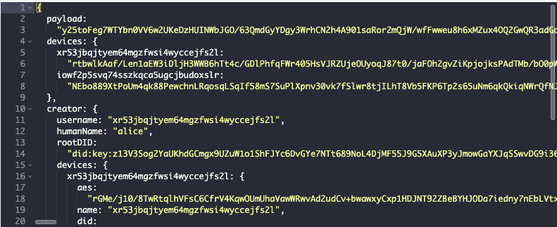

# notes

## server-side

I like that the server doesn't need to do very much. It shuffles encrypted strings between clients and the database. 

Verifying requests actually is a kind of substantial task though. It would be nice if I could find a way to factor out that part.

We need to verify the identity of the requester from just a public key. Each username has many devices, each with its own public key. So we need to map public keys to identities. A fairly simple task, but it's something I didn't get to, in the interest of keeping the server simpler. Instead every request contains a signed certificate, from the "root" device  to the active device. That way we are able to verify, at request time,  that a given public key is related to a given root ID. 


--------------------------------------------------------------------


## indexedDB

### secondary indexes

LevelDB is great. It gives you a fast, persistent key/value store, plus range queries. *But*... what about secondary indexes? In levelDB, you always have a `key` property on any record. This is the basis for range queries -- sorted keys. Lets say you want to keep a record for users, and the primary key is an ID. But you also want to be able to get them by their name.

[See levelDB README -- the secondary index example](https://github.com/Level/abstract-level?tab=readme-ov-file#dbbatchoperations-options)

Use [level.sublevel](https://github.com/Level/abstract-level?tab=readme-ov-file#sublevel) + `level.batch`.

```js
const people = db.sublevel('people', { valueEncoding: 'json' })
const nameIndex = db.sublevel('names')

await db.batch([{
  type: 'put',
  sublevel: people,
  key: '123',
  value: {
    name: 'Alice'
  }
}, {
  type: 'put',
  sublevel: nameIndex,
  key: 'Alice',
  value: '123'
}])
```

Perform multiple put operations in a single transaction, that is, atomically.

In the example we create a second record, that as its value just has the key of the first record. Looking up a user by name is then like this:

```js
const key = await db.get('Alice')
const user = await db.get(key)
```
Use `{ valueEncoding }` to set the type that is returned.

Get values as objects
```js
await db.sublevel('sublevel-name').get('123', { valueEncoding: 'json' })
```

Get values as strings
```js
await db.sublevel('sublevel-name').get('123')
```

Be sure to use the correct key encoding too

```js
await state._db.sublevel('todos').get(1712998923546, { keyEncoding: charwise })
```

-------------------------------


Each todo item is a separate entity in the database.

Write to the local DB. Add a way for the user to write to remote DB.

The todo item format

```ts
interface Metadata {
    id:string,  // the 'key' for this entry. We are using timestamp
    proof:string,  // hash of the (unencrypted) content
    username:string,
    deviceName:string,
    author:DID
}
```

```ts
type EncryptedTodo = {
    metadata:Metadata
    content:string  // stringified & encrypted JSON object
}

type UnencryptedTodo = {
    metadata:Metadata
    content:object  // `content` gets JSON stringified
}
```

## the server view
Your *todo* items are encrypted. The server operator can only see garbled text:


