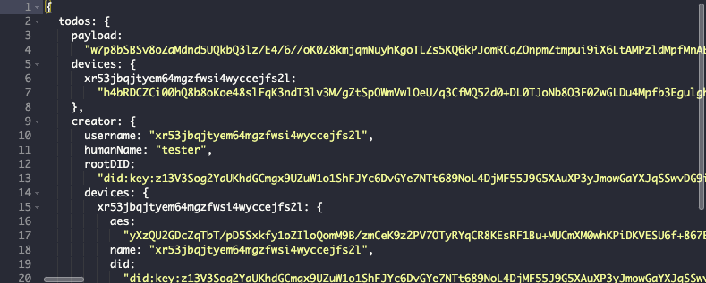

# notes

## indexedDB

Use `{ valueEncoding }` to set the type that is returned.

Get values as objects
```js
await db.sublevel('sublevel-name').get('123', { valueEncoding: 'json' })
```

Get values as strings
```js
await db.sublevel('sublevel-name').get('123')
```

Be sure to use the correct key encoding too

```js
await state._db.sublevel('todos').get(1712998923546, { keyEncoding: charwise })
```

-------------------------------


Each todo item is a separate entity in the database.

Write to the local DB. Add a way for the user to write to remote DB.

The todo item format

```ts
interface Metadata {
    id:string,  // the 'key' for this entry. We are using timestamp
    proof:string,  // hash of the (unencrypted) content
    username:string,
    deviceName:string,
    author:DID
}
```

```ts
type EncryptedTodo = {
    metadata:Metadata
    content:string  // stringified & encrypted JSON object
}

type UnencryptedTodo = {
    metadata:Metadata
    content:object  // `content` gets JSON stringified
}
```

## the server view
Your *todo* items are encrypted. This is what the server operator sees:


